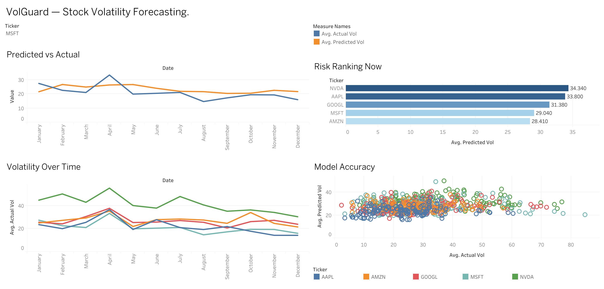

# VolGuard


VolGuard forecasts how **volatile** — not which direction, just how choppy — five stocks (`AAPL`, `AMZN`, `GOOGL`, `MSFT`, `NVDA`) will be over the next 5 trading days. It's an end-to-end pipeline: raw prices → SQL feature engineering → honestly-validated ML model → deployed AWS Lambda → a live results dashboard.

[](https://public.tableau.com/app/profile/vraj.patel6320/viz/VolGuard-StockVolatilityForecasting/Dashboard1)

**Live dashboard:** https://public.tableau.com/app/profile/vraj.patel6320/viz/VolGuard-StockVolatilityForecasting/Dashboard1

---

## Architecture

```
yfinance
   │
   ▼
get_data.py ─────────────────▶ stock_prices.csv
   │
   ▼
build_feature.py  (SQLite, pure SQL)
   │  daily returns, rolling volatility (5/10/30-day),
   │  target = realized volatility over the NEXT 5 trading days (no look-ahead)
   ▼
volguard.db / features_clean.csv
   │
   ▼
walk_forward_validate.py ──▶ finalize_model.py
   │  chronological splits (never shuffled)
   │  4 independent out-of-sample folds
   │  Linear Regression vs. Random Forest vs. XGBoost vs. naive baseline
   ▼
volguard_model.pkl
   │
   ├─────────────────────────────┐
   ▼                             ▼
predict_ticker.py        export_model_json.py ──▶ model.json
(local CLI forecast)                                  │
                                                       │  terraform apply
                                                       ▼
                                     ┌─────────────────────────────────┐
                                     │      AWS (Terraform-managed)     │
                                     │   S3 bucket  ──▶  Lambda         │
                                     │           (lambda_function.py)   │
                                     └─────────────────────────────────┘
                                                       │
                                              aws lambda invoke

build_dashboard_csv.py ──▶ volguard_dashboard.csv ──▶ Tableau Public dashboard
```

---

## Results

Validated with **walk-forward testing** — an expanding window trained only on data strictly before each test period — across **4 independent out-of-sample folds** (roughly Apr–Oct 2024, Oct 2024–May 2025, May–Dec 2025, Dec 2025–Jul 2026), not a single lucky train/test split.

| Model | Features | Walk-forward RMSE | vs. naive baseline |
|---|---|---|---|
| Naive baseline (`vol_5`) | — | 0.01307 | — |
| **Linear Regression (shipped)** | `ret`, `vol_5`, `vol_10`, `vol_30` | **0.01051** | **+19.6%** |
| Linear Regression | + range & volume features | 0.01021 | +21.9% |
| Random Forest (depth=4) | + range & volume features | 0.01071 | +18.1% |
| XGBoost (depth=3) | + range & volume features | 0.01124 | +14.0% |

A simple linear model beat every more complex alternative in every fold. The richer feature set (v2) edges out the shipped model by a margin smaller than the fold-to-fold standard deviation (±0.0022–0.0026) — i.e. within noise — so the simpler, 4-feature model ships.

GARCH(1,1), the classical volatility model, was also benchmarked (single chronological 80/20 split, since refitting it per walk-forward fold is expensive): RMSE 0.00902 vs. a baseline of 0.01159 (**+22.1%**) — in the same range as the ML models, not better.

**Honest limitation:** the shipped model's walk-forward R² is **+0.088** — small but positive. It tracks the general *level* of volatility better than guessing the mean, but it does not anticipate sudden *spikes* (earnings surprises, macro shocks). In plain terms: on the dashboard's test set, predictions are off by about **11–12 percentage points of annualized volatility** on average — useful directionally, not precise.

---

## Repository structure

**Core pipeline**
| File | Purpose |
|---|---|
| `get_data.py` | Pulls ~3 years of daily OHLCV data via `yfinance` |
| `build_feature.py` | Loads prices into SQLite; computes returns, rolling volatility, and the forward-5-day target entirely in SQL |
| `walk_forward_validate.py` | Benchmarks Linear Regression, Random Forest, and XGBoost across 3 feature sets and 4 out-of-sample folds |
| `finalize_model.py` | Reproduces the walk-forward score for the shipped feature set, retrains on all data, saves `volguard_model.pkl` |
| `export_model_json.py` | Extracts the linear model's coefficients into a dependency-free `model.json` |
| `predict_ticker.py` | CLI: forecast next week's volatility for any ticker, using the local model |
| `predict_ticker_s3.py` | Same, but loads the model from S3 (falls back to local if unreachable) |
| `lambda_function.py` | AWS Lambda handler — loads `model.json` from S3, predicts with plain arithmetic, checks an API key |
| `main.tf` | Terraform: S3 bucket, IAM role, Lambda function, public Function URL |
| `build_dashboard_csv.py` | Builds the tidy CSV (walk-forward predictions vs. actuals) that feeds the Tableau dashboard |

**Earlier iterations** (kept to show the experimentation trail — each was evaluated and *not* adopted for the shipped model)
| File | What it tested |
|---|---|
| `build_feature_v2.py` | Added price-range and volume features |
| `add_vix.py` | Added the VIX index as a market-wide feature |
| `train_model.py` / `train_model_log.py` | Single-split benchmark incl. GARCH(1,1); log-target variant |
| `validate_and_select.py` / `validate_v3.py` | Earlier (single-split) feature-set comparisons, superseded by `walk_forward_validate.py` |
| `try_xgboost.py` | First single-split XGBoost test, superseded by the walk-forward version |

---

## How to run

### Setup
```bash
pip install -r requirements.txt
```

### 1. Local pipeline
```bash
python get_data.py                # -> stock_prices.csv
python build_feature.py           # -> volguard.db, features_clean.csv
python walk_forward_validate.py   # benchmark comparison (Linear/RF/XGBoost, 3 feature sets)
python finalize_model.py          # -> volguard_model.pkl (shipped model, all data)
python export_model_json.py       # -> model.json
python predict_ticker.py AAPL MSFT NVDA
python build_dashboard_csv.py     # -> volguard_dashboard.csv (feeds Tableau)
```

### 2. Deploy to AWS
```bash
terraform init

# create terraform.tfvars (gitignored) with a shared secret:
echo 'api_key = "your-own-random-secret"' > terraform.tfvars

terraform plan
terraform apply
```
This provisions an S3 bucket (holding `model.json`), an IAM role, and a Lambda function (`volguard-predict`) with a public Function URL.

To tear everything down:
```bash
terraform destroy
```

### 3. Call the deployed model
The Lambda enforces its own API-key check (via the `x-api-key` header or an `api_key` field in the payload), independent of the Function URL's own access settings:

```bash
aws lambda invoke \
  --function-name volguard-predict \
  --payload '{"ret":0.01,"vol_5":0.015,"vol_10":0.014,"vol_30":0.013,"api_key":"YOUR_API_KEY"}' \
  --cli-binary-format raw-in-base64-out \
  output.json && cat output.json
```

> **Note:** the public Function URL currently returns `403` due to an AWS new-account restriction unrelated to this project's code (confirmed via a signed request from the account owner still being blocked, plus an unusually low account concurrency limit — a pending AWS Support case). Until that's lifted, the model is called via the AWS CLI/SDK (`aws lambda invoke`) as shown above, or locally via `predict_ticker_s3.py`.

---

## Methodology notes

- **Chronological splits, always.** No shuffling anywhere — every train/test split respects time order, so the model never sees the future.
- **Walk-forward validation:** an expanding window with 5 chronological folds. Fold 0 (oldest ~20% of days) seeds training only; folds 1–4 are each scored with a model trained exclusively on strictly earlier data, giving 4 genuinely independent out-of-sample evaluations instead of one.
- **Metrics:** RMSE (root mean squared error) and MAE (mean absolute error), both in daily-volatility units; R² (variance explained relative to always predicting the mean).
- **Target definition:** realized volatility over the next 5 trading days = the standard deviation of daily returns over that window, computed with no look-ahead.
- **Annualization:** daily volatility × √252 × 100, converting to the "X% per year" form most people recognize.

## Tech stack
Python · pandas · scikit-learn · XGBoost · `arch` (GARCH) · SQLite/SQL · yfinance · joblib · AWS (S3, Lambda) · Terraform · Tableau

---

*This project forecasts volatility (how much a price might move), not direction (whether it goes up or down). It is a portfolio/learning project, not financial advice.*
